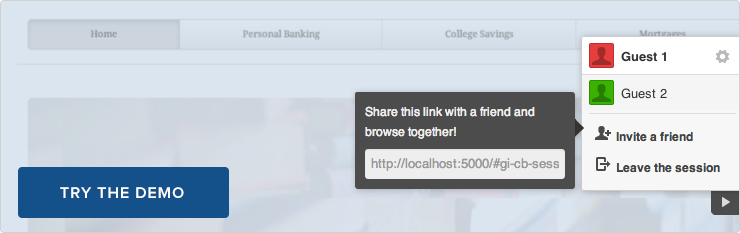

# Collaboration Bundle

The Collaboration Bundle collects the [GoInstant widgets](./index.md) together,
providing an easy-to-use, drop-in collaboration layer atop any website.

[](https://collab-bundle-demo.herokuapp.com)

## Features
- Easy-to-use invitation URLs allow users to share their experience.
- Navigate together. The bundle will keep users on the same URL at all
  times.
- Same-origin policy is respected, meaning that users will stay safely on the
  origin that initiated the bundle.
- Provides user presence, form collaboration and chat in any web site.
- Includes click and scroll indicators to understand what people are doing, and
  where they're doing it on a web page.

## Demo

See a demonstration of the Collaboration Bundle on this [web site](https://collab-bundle-demo.herokuapp.com).

## Table of Contents

1. [Installation](#installation)
1. [Limitations](#limitations)
1. [HTML & CSS](#html-&-css)
1. [Constructor](#constructor)
1. [CollaborationBundle#initialize](#collaborationbundle#initialize)
1. [CollaborationBundle#destroy](#collaborationbundle#destroy)

## Installation

### 1. Include our CDN assets:

#### Note on Versioning

Specific version of widgets can be found on our [CDN](https://cdn.goinstant.net/).

```html
<script type="text/javascript" src="https://cdn.goinstant.net/v1/platform.min.js"></script>
<script type="text/javascript" src="https://cdn.goinstant.net/widgets/collaboration-bundle/latest/collaboration-bundle.min.js"></script>
<link rel="stylesheet" href="https://cdn.goinstant.net/widgets/collaboration-bundle/latest/collaboration-bundle.css" />
```

### 2. Initialize the CollaborationBundle widget.

```js
// Connect URL
var collaborationBundle = new goinstant.widgets.CollaborationBundle({
  connectUrl: 'https://goinstant.net/YOURACCOUNT/YOURAPP'
});
collaborationBundle.initialize();
```


When the bundle is first initialized, a "Collaborate Now!" button appears on the
page. Clicking the button will start a collaboration session, at which point an
invitation URL is provided. Share the URL with others and when they navigate to
it, they'll join you in the session.

## Limitations

### Designed for Convential Web Applications and Pages

The Collaboration Bundle is currently designed for conventional web applications
that follow the conventions of anchor elements (HTTP GETs) and form elements
(HTTP POSTs), without the use of AJAX or complex JavaScript.

AJAX/JavaScript application support will be fleshed out in the future,
based on interest in the bundle.

### Navigation requires URLs to be accessible by all users

The Collaboration Bundle does not share cookies between users, and respects the
browser security model. Each user in a session must be authorized to load all
assets needed on the site being browsed.

### Navigation requires URLs to be accessible via HTTP GET

The resulting URL of any form in your page must also be accessible via HTTP GET.

The bundle navigates users together with GETs.

If a form has the POST method, the following will occur:

1. The submitting user will send the form's HTTP request to the server.
2. The submitting user will navigate to the URL that the server directs them
   to.
3. The submitting user will direct the other users to join them.
4. The other users will navigate to the same URL as the submitting user with a
   GET instead of a POST.

### Including the Script

The Collaboration Bundle script must be included and initialized on all pages
within a web site. This is easiest when a server has a layout file, as in
most PHP applications and Ruby on Rails.

If a web page is entirely static assets, this will mean following the
[installation instructions](#installation) on every static HTML document that is
intended to be shared.

## HTML & CSS

Refer to the individual [widgets](./index.md) for customizing appearance.

## Constructor

Creates the CollaborationBundle instance.

### Methods

- ###### **new CollaborationBundle(optionsObject)**

### Parameters

| optionsObject |
|:---|
| Type: [String](https://developer.mozilla.org/en-US/docs/Web/JavaScript/Reference/Global_Objects/String) |
| Your registered application URL, which is an application ID in the form of a URL. (e.g. `https://goinstant.net/YOURACCOUNT/YOURAPP`). |

### Example

#### Basic

```js
var collaborationBundle = new goinstant.widgets.CollaborationBundle({
  connectUrl: 'https://goinstant.net/YOURACCOUNT/YOURAPP'
});
```

## CollaborationBundle#initialize

Initializes the CollaborationBundle bundle on the page. If a collaboration
session has been activated for this browser, it will ensure that the browser is
displaying the correct page, and that the widgets are all rendered correctly.

### Methods

- ###### **collaborationBundle.initialize(callback(errorObject))**

### Parameters

| callback(errorObject) |
|:---|
| Type: [Function](https://developer.mozilla.org/en-US/docs/Web/JavaScript/Reference/Global_Objects/Function) |
| A callback function that is returned once collaborationBundle has completed being initalized. |
| - `errorObject` - will be null, unless an error has occurred. |

### Example

```js
collaborationBundle.initialize(function(err) {
  // now the collaboration widgets are initialized
});
```

## CollaborationBundle#destroy

Removes the CollaborationBundle session from the page. This will leave them on the page
they were already viewing, with CollaborationBundle deactivated.

### Methods

- ###### **collaborationBundle.destroy(callback(errorObject))**

### Parameters

| callback(errorObject) |
|:---|
| Type: [Function](https://developer.mozilla.org/en-US/docs/Web/JavaScript/Reference/Global_Objects/Function) |
| A callback function that is returned once collaborationBundle has completed being destroyed. |
| - `errorObject` - will be null, unless an error has occurred. |

### Example

```js
collaborationBundle.destroy(function(err) {
  // done
});
```
